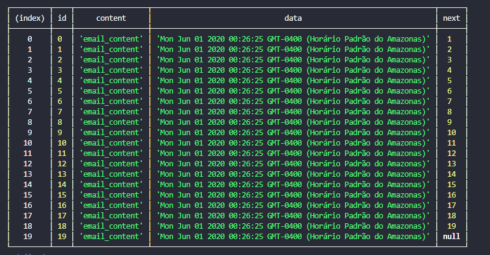
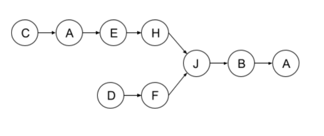

## how to use

This is a node project then you can to install this project from NPM repository

### 1st step
    npm i -g test-skill

### 2nd Step

There are 5 question such as follow: 
    q1 - q2 - q3 - q5 and q7

To execute and test these question just to use --q flag for example:
 
     - to execute q1 you must to type: skill --q1

Some question needs arguments to pass, please use --help to check it
      
      - skill --q2 --help and a help text will be show

## Arrays and Strings
### 1. Replacing characters in place:

    Example:
    Input: “User is not allowed “, 19
    Output: “User&32is&32not&32allowed”

### How to test it ??
     skill --q1

* can to improve it with other sentences... Just to improve it just use --range flag to use more preloaded sentences:

      skill --q1 --range=5  

* By default all spaces are replaced by &32 but you can change it just use --raplaceTo flag

      skill --q1 --replaceTo=hello

## 2. Check words with jumbled letters :

    Examples:
    you, yuo ­> true
    probably, porbalby ­> true
    despite, desptie ­> true
    moon, nmoo ­> false
    misspellings, mpeissngslli ­> false

### How to test it ??

    skill --q2 --str1=you --str2=yuo

In this case, if there is a partial­permutation then return true if not return false

## 3. Check words with typos:

    Examples:
    pale, ple ­> true
    pales, pale ­> true
    pale, bale ­> true
    pale, bake ­> false

### How to test it ?

    skill --q3 --str1=pale --str2=ple

#### The return
    ┌─────────┬───────┬────────┐
    │ (index) │ value │ status │
    ├─────────┼───────┼────────┤
    │    0    │  'p'  │  true  │
    │    1    │  'a'  │ false  │
    │    2    │  'l'  │  true  │
    │    3    │  'e'  │  true  │
    └─────────┴───────┴────────┘
    true

 if there is a typo and return true if not false

 ## 5. Remove duplicates on email thread:

When different email clients are used on a same thread, the discussion get messy
because old messages are included again and get duplicated. Given a email thread
(represented by a singly unsorted linked list of messages), write a function that
remove duplicated messages from it.

### How to test it ?

   skill --q5

#### The Return

Fisrt a Big and duplicate single linked list is made 

and the return is a list withou duplicate data

    

## 7. Linked List Intersection:

## how to test it ?

    $ skill --q7
            13 ->85 ->23 ->31 ->84 ->19 ->26 ->22 ->7 ->70 ->41 ->11 ->66 ->8 ->76 ->1 ->23 ->70 ->79 ->13 ->5 ->43 -> end

            14 ->12 ->22 ->70 ->2 ->31 ->84 ->19 ->26 ->22 ->7 ->70 ->41 ->11 ->66 ->8 ->76 ->1 ->23 ->70 ->79 ->13 ->5 ->43 -> end

    there is a intersaction in 5 position
    position is initialized from 0

### The return
In this case two list are printed and the intersaction index between these list is shown
