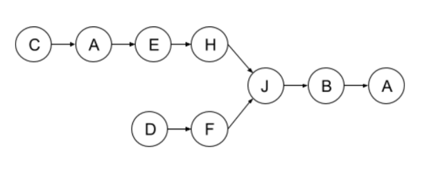

## 7. Linked List Intersection:
   
    If two requests on the queue have linked lists that intersect (like the example below),
    previous service could be improved to process only the difference between them.
    Write a method that receives two singly linked lists and return the intersecting node
    of the two lists (if exists). Note that the intersection is defined by reference, not value.
    (No need to change previous answer).

